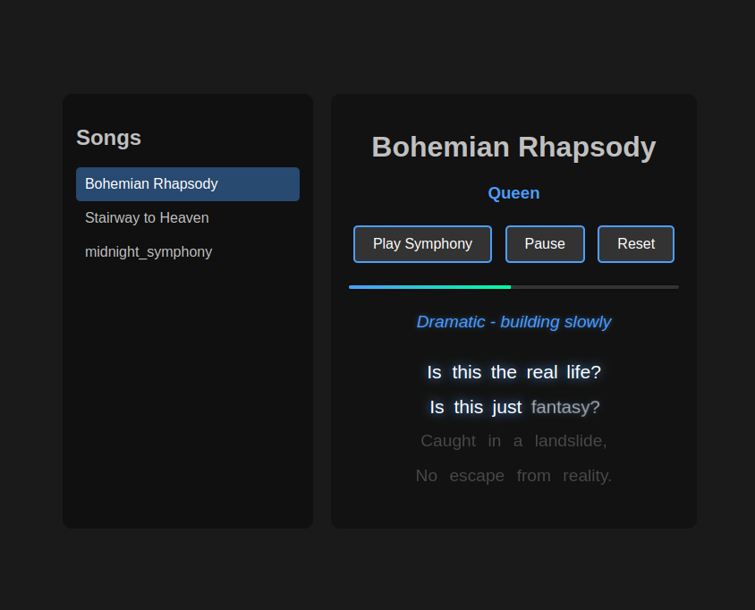

# Karaoke App

An interactive karaoke application that displays synchronized lyrics with timing controls and a sleek dark theme interface.

## Features
- Song list with dynamic loading
- Synchronized lyrics display with word-by-word highlighting
- Play/Pause/Reset controls
- Progress bar showing song position
- Dark theme UI for optimal viewing
- Artist information display

## Requirements
- Node.js
- npm

## Installation
1. Clone the repository
2. Run `npm install` to install dependencies
3. Start the server: `node server.js`
4. Open `http://localhost:3000` in your browser

## File Structure
```
karaoke-app/
├── server.js          # Express server handling song listing and lyrics
├── index.html         # Main application interface
├── package.json       # Project dependencies
└── lyrics/           # Song lyrics in JSON format
    ├── midnight_symphony.json
    ├── bohemian_rhapsody.json
    └── stairway_to_heaven.json
```

## Lyrics Format
Songs are stored in JSON format with the following structure:
```json
{
  "title": "Song Title",
  "artist": "Artist Name",
  "verses": [
    {
      "direction": {
        "text": "Performance direction",
        "time": 0
      },
      "lines": [
        {
          "words": [
            {"text": "word", "time": 1000}
          ]
        }
      ]
    }
  ],
  "totalDuration": 12000
}
```

## API Endpoints
- GET `/songs` - Returns list of available songs
- GET `/lyrics/:songTitle` - Returns lyrics and timing data for specified song

## Technologies Used
- Express.js for backend server
- Vanilla JavaScript for frontend
- HTML5/CSS3 for UI

## License
MIT License
